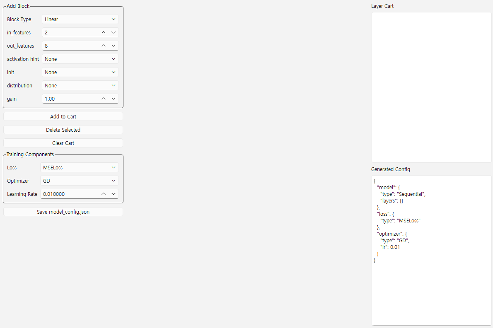

# NeuralCart

NeuralCart는 딥러닝 모델을 '카트 방식으로 구성'할 수 있는 프레임워크입니다.

- PyTorch, Tensorflow 없이 구현한 딥러닝 엔진입니다.
- JSON config 기반으로 모델 아키텍처를 생성합니다.
- PySide6 기반 설계된 프로그램입니다.

## 구조(v0.1)
- ModuleCart : 기본 모듈 시스템
- ParameterCart : 학습 파라미터 관리
- LayerCart : Linear 레이어
- ActivationCart : ReLU, Sigmoid, Tanh
- OptimizerCart : GD, Adam
- BuilderCart : config / 모델 생성
- ShapeCart : weight metrix dimention 검증

## UI Preview

  

